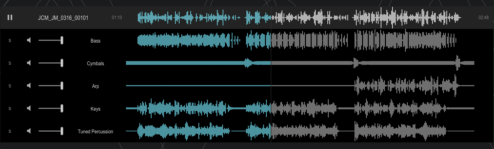

# General

A streaming, low latency Stem Player Web-Component



[See this live example of our stem player](https://stemplayer-js.com)

## Contributing

> This repo is a subtree split of our monorepo which will be made public in due course. We cannot process any pull-requests to this repo. Please contact us for help.

# Installation

simply execute

```shell
npm install @stemplayer-js/stemplayer-js lit
```

or using yarn

```shell
yarn add @stemplayer-js/stemplayer-js lit
```

# Usage

The component can be either instantiated as HTML

```html
<script type="module">
  import { defineCustomElements } from '@stemplayer-js/stemplayer-js';

  // first register the custom elements
  defineCustomElements();
</script>
<soundws-stem-player row-height="60px" sample-rate="22050">
  <soundws-stem-player-controls
    label="A label"
    wave-color="white"
    wave-progress-color="rgb(0, 206, 224)"
  ></soundws-stem-player-controls>
  <soundws-stem
    label="Drums A"
    src="https://your-cdn-com/drums.m3u8"
    waveform="https://your-cdn-com/drums.json"
    volume="0.1"
  >
  </soundws-stem>
  <soundws-stem
    label="Vocals"
    src="https://your-cdn-com/vocals.m3u8"
    waveform="https://your-cdn-com/vocals.json"
    muted="true"
    volume="0.2"
  ></soundws-stem>
</soundws-stem-player>
```

or using javascript

```javascript
import { defineCustomElements } from '@stemplayer-js/stemplayer-js';

// first register the custom elements
defineCustomElements();

// create the stems-player web-component
const player = document.createElement('soundws-stem-player');

// append the controls web-component
const controls = document.createElement('soundws-stem-player-controls');
controls.label = 'Stems rule!';
player.appendChild(controls);

// append a stem web-component
const drums = document.createElement('soundws-stem');
drums.label = 'Drums';
drums.src = 'https://your-cdn-com/drums.m3u8;
drums.waveform = 'https://your-cdn-com/drums.json';
player.appendChild(drums);

// append a stem web-component
const vocals = document.createElement('soundws-stem');
vocals.label = 'Vocals';
vocals.src = 'https://your-cdn-com/vocals.m3u8;
vocals.waveform = 'https://your-cdn-com/vocals.json';
player.appendChild(vocals);

// listen to some events
player.addEventListener('timeupdate', () => { /* do something */ });
player.addEventListener('end', () => { /* do something */ });
```

See [docs](./docs) for more information.

## Demo

Clone this repo and run

```bash
npm install
npm start
```

# Browser Support

The Player works in [browsers supporting the Web Audio API](https://caniuse.com/#feat=audio-api). This includes most modern browsers.

The stem player is built as a [web-component](https://caniuse.com/?search=web%20components) which is supported natively by most modern browsers.

A bundles ES module is provided, transpiled to support modern browsers.

For targeting older browsers, you can utilise your own build system.

[Polyfills for web-components](https://www.jsdelivr.com/package/npm/@webcomponents/webcomponentsjs) exist for support for older browsers.

# Audio

The player consumes m3u8 playlist files known from the [HLS protocol](https://en.wikipedia.org/wiki/HTTP_Live_Streaming).

The audio is split up into chunks and served (over simple HTTP) separately.

Why HLS and not just download whole files? Downloading and decoding, for example, 10 5minute audio files will consume bandwith and bloat memory: each minute of every audio file worth of mp3 data is decoded into 44k PCM data and will consume roughly 100mb. By using live streaming we not only speed up playback, we also reduce the memory footprint.

Why not progressive download? We need to use the web audio API to achieve precise synchronized playback.

See also

- [https://ffmpeg.org/ffmpeg-formats.html#toc-hls-1](https://ffmpeg.org/ffmpeg-formats.html#toc-hls-1)
- [https://ffmpeg.org/ffmpeg-formats.html#toc-segment_002c-stream_005fsegment_002c-ssegment](https://ffmpeg.org/ffmpeg-formats.html#toc-segment_002c-stream_005fsegment_002c-ssegment)

See also this [Docker image](https://github.com/sound-ws/docker-segment-audio) to help you segment your audio.

# Waveforms

Because we don't download the entire audio file, we cannot analyse the audio so that we can display a nice waveform. So unfortunately these also need to be pre-generated. Although inconvenient, it is probably good practice anyway as a waveform in json format is very small in size; there is no need to re-compute it time and time again.

[See here for info on how to generate compatible waveforms](https://github.com/bbc/audiowaveform). Make sure you limit the `--pixels-per-second` to around `20`, since by default the library will output that contains too much detail.

The output will have to be normalized so the waveform will be represented by an array of numbers that is between -1 and +1.

See here for a [Docker image](https://github.com/sound-ws/docker-generate-waveforms) which should (hopefully) help.

# ES modules and bare imports in the browser

This

```js
import { defineCustomElements } from '@stemplayer-js/stemplayer-js';
```

should work fine when using node, webpack etc. to create a bundled application.

However when using ES modules directly in the browser this will lead to an error:

> failed to resolve module specifier "lit". Relative references must start with either "/", "./", or "../".

In order to resolve this we need to rely on [import-maps](https://blog.logrocket.com/es-modules-in-browsers-with-import-maps/). This is because module resolution in the browser works differently from what we are used to from Node.

```html
<script type="importmap">
  {
    "imports": {
      "lit": "https://cdn.jsdelivr.net/npm/lit-element@3.3.2/+esm"
    }
  }
</script>
<script type="module">
  import { defineCustomElements } from '@stemplayer-js/stemplayer-js';
  defineCustomElements();
</script>
```

# License

Copyright (C) 2019-2023 First Coders LTD

This program is free software: you can redistribute it and/or modify
it under the terms of the GNU General Public License as published by
the Free Software Foundation, either version 3 of the License, or
(at your option) any later version.

This program is distributed in the hope that it will be useful,
but WITHOUT ANY WARRANTY; without even the implied warranty of
MERCHANTABILITY or FITNESS FOR A PARTICULAR PURPOSE. See the
GNU General Public License for more details.

You should have received a copy of the GNU General Public License
along with this program. If not, see <https://www.gnu.org/licenses/>.
